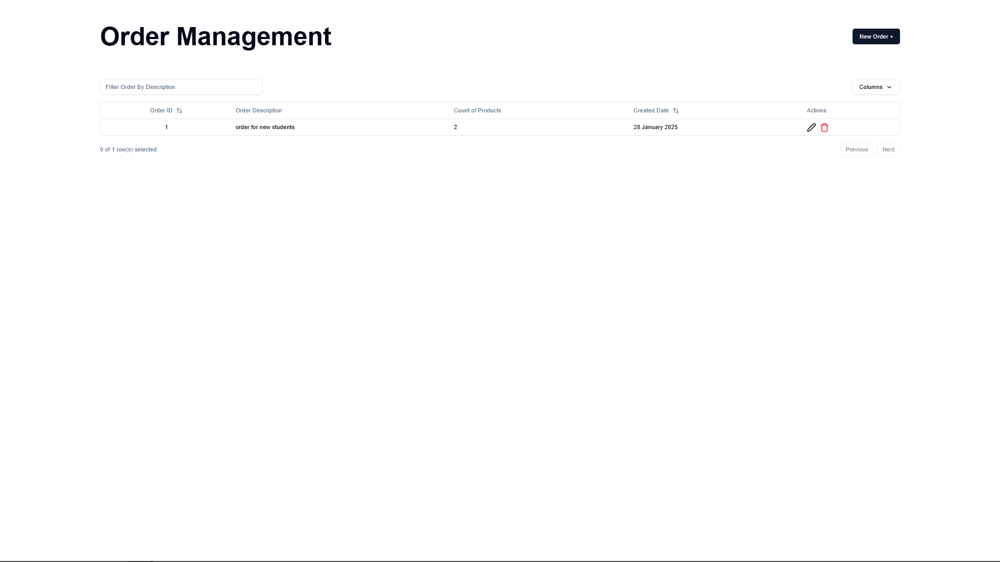
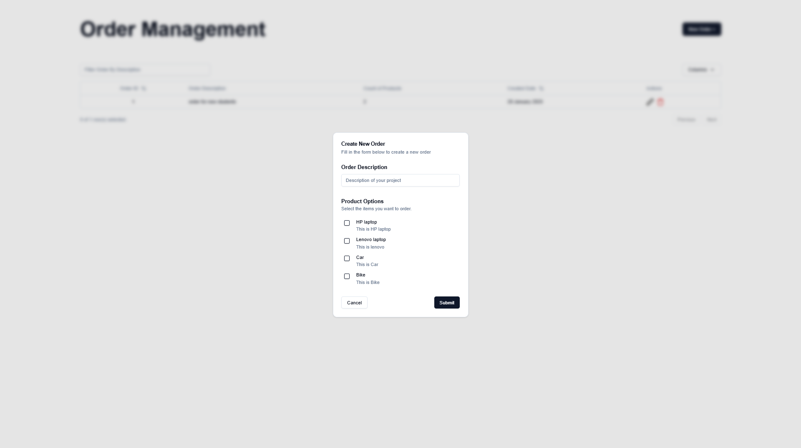
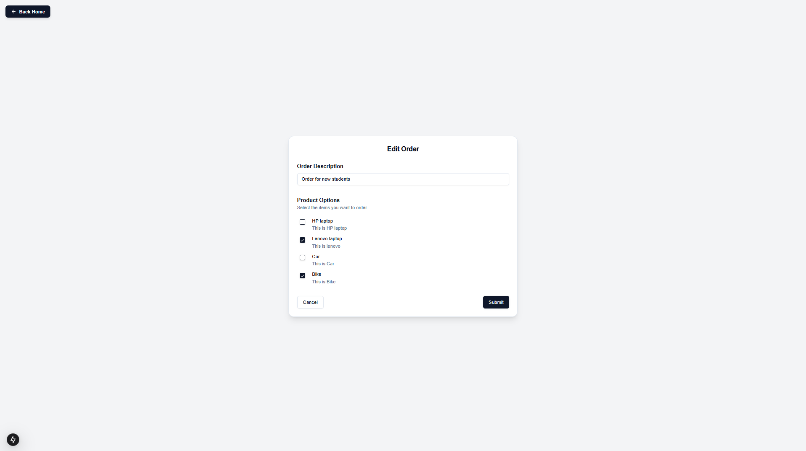
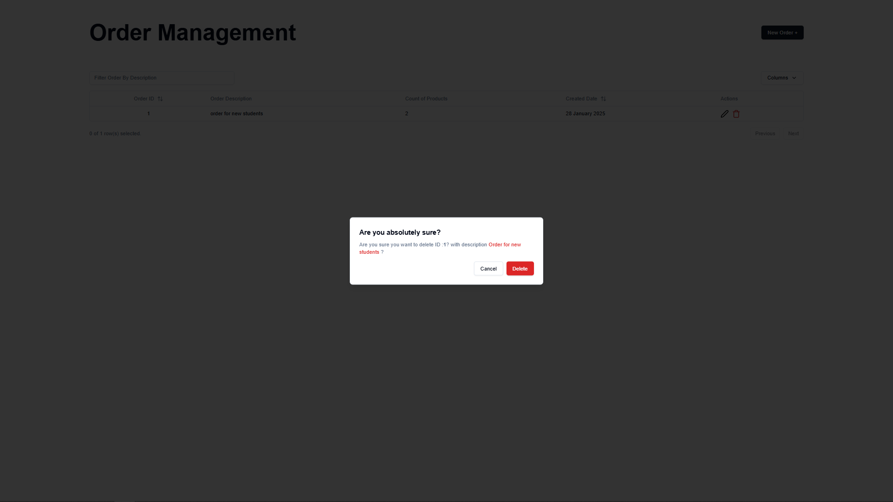

# Order Management System

Welcome to the **Order Management System**, a modern and efficient web application built using **Next.js 15** and *
*Prisma**. This project showcases my skills in full-stack development, including API creation, database management, and
UI design. Below, you'll find all the details about the project, including the technologies used, API endpoints, and
screenshots of the application.

---

## 🚀 Features

- **CRUD Operations**: Create, Read, Update, and Delete orders seamlessly.
- **Modern UI**: Built with **Tailwind CSS** and **Radix UI** for a sleek and responsive design.
- **State Management**: Utilizes **React Query** for efficient data fetching and caching.
- **Form Handling**: Powered by **React Hook Form** and **Zod** for robust form validation.
- **Animations**: Enhanced user experience with **Framer Motion** animations.
- **Real-time Feedback**: Toast notifications using **Sonner**.

---

## 🛠️ Technologies Used

### Core Technologies

- **Next.js 15**: For server-side rendering and API routes.
- **Prisma**: As the ORM for database management.
- **PostgreSQL**: As the database for storing order data.

### Key Libraries

- **React Query**: For data fetching and state management.
- **React Hook Form + Zod**: For form handling and validation.
- **Tailwind CSS**: For styling and responsive design.
- **Radix UI**: For accessible and customizable UI components.
- **Framer Motion**: For animations and transitions.
- **Sonner**: For toast notifications.

---


---

## 🌐 API Endpoints

The following API endpoints are available for managing orders:

| Method | Endpoint                                                 | Description           |
|--------|----------------------------------------------------------|-----------------------|
| GET    | `https://assignment7-frontend.vercel.app/api/orders`     | Get all orders        |
| GET    | `https://assignment7-frontend.vercel.app/api/orders/:id` | Get an order by ID    |
| POST   | `https://assignment7-frontend.vercel.app/api/orders`     | Add a new order       |
| PUT    | `https://assignment7-frontend.vercel.app/api/orders/:id` | Update an order by ID |
| DELETE | `https://assignment7-frontend.vercel.app/api/orders/:id` | Delete an order by ID |

---

## 🖼️ Screenshots

Below are the screenshots of the application:

### 1. **Home Page**

  
*Displays a list of all orders with options to view, edit, or delete.*

### 2. **Add Order**

  
*A form to add a new order with validation.*

### 3. **Update Order Page**

  
*Edit an existing order with pre-filled form fields.*

### 4. **Delete Order**

  
*Confirmation dialog to delete an order.*

---

## 🛠️ Installation

1. Clone the repository:
   ```bash
   git clone https://github.com/lakshaykhokhar2003/assignment7_frontend
    ```
2. Navigate to the project directory:
   ```bash
   cd assignment7_frontend
   ```
3. Install the dependencies:
   ```bash
    npm install
    ```
4. Setup the environment variables:
    - Create a `.env` file in the root directory.
    - Add the following environment variables:
      ```env
      DATABASE_URL=your_database_url
      NEXT_PUBLIC_SERVER_URL=your_server_url
      ```
5. Run the development server:
    ```bash
    npm run dev
    ```

## 🚀 Deployment

This project is deployed on Vercel. You can access the live demo here:
[Order Management System](https://assignment7-frontend.vercel.app/)

## 🙏 Acknowledgments

- **Next.js** for providing a powerful framework for React applications.
- **Prisma** for simplifying database management.
- **Tailwind CSS** for making styling a breeze.
- **React Query** for efficient data fetching and caching.

Feel free to explore the code and contribute to the project. If you have any questions or feedback, please open an issue
or reach out to me directly. Happy coding! 🎉